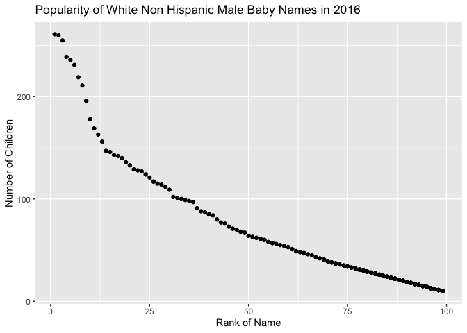

Homework 2
================
Saryu Patel
10/4/2021

``` r
library(tidyverse)
library(readxl)
```

### Problem 1

``` r
trash_df <- 
  read_excel("data/Trash-Wheel-Collection-Totals-7-2020-2.xlsx", range = "A2:N408") %>% 
  janitor::clean_names() %>% 
  drop_na() %>% 
  mutate(sports_balls = round(sports_balls))
```

``` r
precip_18 <- 
  read_excel("data/Trash-Wheel-Collection-Totals-7-2020-2.xlsx", sheet = 7, range = "A2:B14") %>% 
  janitor::clean_names() %>% 
  mutate(year = 2018)

precip_19 <- 
  read_excel("data/Trash-Wheel-Collection-Totals-7-2020-2.xlsx", sheet = 6, range = "A2:B14") %>% 
  janitor::clean_names() %>% 
  mutate(year = 2019)

precip_df <- 
  bind_rows(precip_18, precip_19) %>% 
  mutate(month = month.name[month])
```

#### Mr. Trash Wheel Dataset

There are 345 observations and 14 variables in the Mr. Trash Wheel
dataset. Some key variables in this dataset include the weight of the
trash in each dumpster in tons and the volume of the trash in cubic
yards. The median number of sports balls in a dumpster in 2019 was 9.

#### Precipitation Dataset

There are 24 observations and 3 variables in the resulting precipitation
dataset. The key variable in this dataset is the total amount of
precipitation each month. The total precipitation in 2018 was 70.33
inches, while the total precipitation in 2019 from January through June
was 33.95 inches.

### Problem 2

Politicians Dataset

``` r
pols_df <- 
  read_csv("data/fivethirtyeight_datasets/pols-month.csv") %>% 
  separate(mon, into = c("year", "month", "day")) %>% 
  mutate(month = month.abb[as.numeric(month)],
         president = recode(prez_dem, `1` = "dem", `0` = "gop")) %>% 
  select(-c(day, prez_gop, prez_dem))
```

S&P Stock Dataset

``` r
snp_df <- read_csv("data/fivethirtyeight_datasets/snp.csv")

dates <- snp_df$date %>% as.Date(., "%m/%d/%y")
dates <- as.Date(ifelse(dates > Sys.Date(), format(dates, "19%y-%m-%d"), format(dates)))
snp_df$date = dates

snp_df <- snp_df %>% 
  separate(date, into = c("year", "month", "day")) %>% 
  mutate(month = month.abb[as.numeric(month)]) %>% 
  select(-day)
```

Unemployment Dataset

``` r
unemp_df <- 
  read_csv("data/fivethirtyeight_datasets/unemployment.csv") %>% 
  pivot_longer(
    Jan:Dec,
    names_to = "month",
    values_to = "unemp_rate"
  ) %>% 
  janitor::clean_names()

unemp_df$year <- as.character(unemp_df$year)
```

Merge

``` r
final_df <- 
  pols_df %>% 
  left_join(snp_df, by = c("year", "month")) %>% 
  left_join(unemp_df, by = c("year", "month"))
```

The `pols-month.csv` dataset contains information about politicians and
the number of which are democratic or republican over time. Once
cleaned, it has 822 observations and 9 variables. The `snp.csv` dataset
contains information about the stock Standard & Poor’s closing value for
each day of observation. After cleaning, this data set has 787
observations and 3 variables. The `unemployment.csv` dataset contains
information about the unemployment rate for each month throughout each
year included in the dataset. This dataset has 816 observations and 3
variables.

Once these three datasets are combined, the resulting data set contains
822 observations and 11 variables. The years included in the combined
dataset range from 1947 to 2015. Some key variables include `president`,
`close`, and `unemp_rate`. Of the observations in the combined dataset,
390 of the months had a democratic president, and 432 had a republican
president. The mean closing value in 2008 was 1215.22 while the mean
unemployment rate was 5.8 that year.

### Problem 3

``` r
baby_names <-
  read_csv("data/Popular_Baby_Names.csv") %>% 
  janitor::clean_names()

baby_names$gender <- tolower(baby_names$gender)
baby_names$ethnicity <- stringr::str_to_title(baby_names$ethnicity)
baby_names$childs_first_name <- stringr::str_to_title(baby_names$childs_first_name)

baby_names <- distinct(baby_names)

baby_names$ethnicity[baby_names$ethnicity == "Asian And Paci"] <- 
  "Asian And Pacific Islander"
baby_names$ethnicity[baby_names$ethnicity == "Black Non Hisp"] <- 
  "Black Non Hispanic"
baby_names$ethnicity[baby_names$ethnicity == "White Non Hisp"] <- 
  "White Non Hispanic"
```

Popularity of “Olivia” over time

``` r
baby_names %>% 
  filter(childs_first_name == "Olivia") %>% 
  select(ethnicity, year_of_birth, rank) %>% 
  pivot_wider(names_from = year_of_birth,
              values_from = rank) %>% 
  relocate(ethnicity, `2011`, `2012`, `2013`, `2014`, `2015`, `2016`)
```

    ## # A tibble: 4 × 7
    ##   ethnicity                  `2011` `2012` `2013` `2014` `2015` `2016`
    ##   <chr>                       <dbl>  <dbl>  <dbl>  <dbl>  <dbl>  <dbl>
    ## 1 Asian And Pacific Islander      4      3      3      1      1      1
    ## 2 Black Non Hispanic             10      8      6      8      4      8
    ## 3 Hispanic                       18     22     22     16     16     13
    ## 4 White Non Hispanic              2      4      1      1      1      1

Most popular male name over time

``` r
baby_names %>% 
  filter(gender == "male", rank == 1) %>% 
  select(ethnicity, year_of_birth, childs_first_name) %>% 
  pivot_wider(
    names_from = year_of_birth,
    values_from = childs_first_name
  )
```

    ## # A tibble: 4 × 7
    ##   ethnicity                  `2016` `2015` `2014` `2013` `2012` `2011` 
    ##   <chr>                      <chr>  <chr>  <chr>  <chr>  <chr>  <chr>  
    ## 1 Asian And Pacific Islander Ethan  Jayden Jayden Jayden Ryan   Ethan  
    ## 2 Black Non Hispanic         Noah   Noah   Ethan  Ethan  Jayden Jayden 
    ## 3 Hispanic                   Liam   Liam   Liam   Jayden Jayden Jayden 
    ## 4 White Non Hispanic         Joseph David  Joseph David  Joseph Michael

Finally, for male, white non-hispanic children born in 2016, produce a
scatter plot showing the number of children with a name (y axis) against
the rank in popularity of that name (x axis).

Scatterplot

``` r
baby_names %>% 
  filter(gender == "male", ethnicity == "White Non Hispanic", year_of_birth == 2016) %>% 
  ggplot(aes(x = rank, y = count)) +
  geom_point() + 
  labs(
    title = "Count of Baby Names vs Rank of Baby Names"
  )
```

<!-- -->
